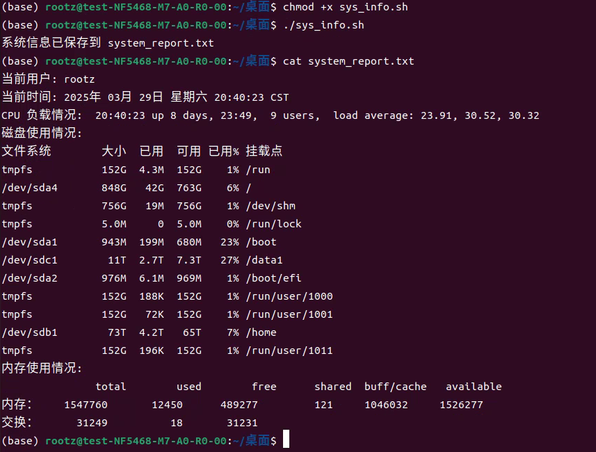

# 曾权宏 324080203112 机械241班
-----------------------------------------
# （1）3_27 函数与循环.py：实现多种计算功能。
```python
import tkinter as tk
from tkinter import messagebox

# 计算阶乘的函数
def factorial(n):
    if n < 0:
        print("计算阶乘n为非负整数！")
        return None  # 返回 None 表示无效输入
    result = 1
    for i in range(1, n + 1):
        result *= i
    return result

# 判断质数的函数
def is_prime(n):
    if n <= 1:
        return False
    for i in range(2, int(n ** 0.5) + 1):
        if n % i == 0:
            return False
    return True

# 生成斐波那契数列的函数
def fibonacci(n):
    fib_sequence = []
    a, b = 0, 1
    for _ in range(n):
        fib_sequence.append(a)
        a, b = b, a + b
    return fib_sequence

# 当点击按钮时执行相应的操作
def calculate():
    try:
        n = int(entry.get())  # 获取用户输入的数字
        choice = var.get()  # 获取用户选择的功能

        if choice == 1:
            result = factorial(n)
            if result is not None:  # 确保计算结果有效
                messagebox.showinfo("结果", f"{n} 的阶乘是 {result}")
            else:
                messagebox.showerror("错误", "阶乘计算失败，请输入非负整数")
        elif choice == 2:
            result = "是质数" if is_prime(n) else "不是质数"
            messagebox.showinfo("结果", f"{n} {result}")
        elif choice == 3:
            result = fibonacci(n)
            messagebox.showinfo("结果", f"前 {n} 项斐波那契数列是 {result}")
        else:
            messagebox.showerror("错误", "请选择一个有效的功能")
    except ValueError:
        messagebox.showerror("错误", "请输入一个有效的数字")

# 创建主窗口
root = tk.Tk()
root.title("Python 功能选择")

# 标签
label = tk.Label(root, text="请输入一个数字:")
label.pack(pady=10)

# 输入框
entry = tk.Entry(root)
entry.pack(pady=10)

# 单选框：选择功能
var = tk.IntVar()
radio_factorial = tk.Radiobutton(root, text="计算阶乘", variable=var, value=1)
radio_prime = tk.Radiobutton(root, text="判断质数", variable=var, value=2)
radio_fibonacci = tk.Radiobutton(root, text="生成斐波那契数列", variable=var, value=3)

radio_factorial.pack()
radio_prime.pack()
radio_fibonacci.pack()

# 按钮：执行计算
button = tk.Button(root, text="计算", command=calculate)
button.pack(pady=20)

# 启动主循环
root.mainloop()
```
# （2）任务 1:系统信息收集
```bash

```

## 功能描述
编写一个 Bash 脚本 `sys_info.sh`，用于收集并保存系统信息。脚本执行后会显示并保存以下信息到 `system_report.txt` 文件中：
## 使用方法

步骤 1：保存脚本，将脚本内容保存为 `sys_info.sh` 文件。

步骤 2：赋予执行权限，在终端中运行以下命令为脚本文件添加执行权限：

```bash
chmod +x sys_info.sh
```

步骤 3：执行脚本，收集并保存系统信息：
```bash
./sys_info.sh
```
执行完成后，脚本会在当前目录下生成一个 system_report.txt 文件，其中包含了当前用户、时间、CPU 负载、磁盘使用情况、内存使用情况等信息。

步骤 4：查看输出：
```bash
cat system_report.txt
```
## 截图



# （3）任务 2:批量创建用户
```bash

```
## 功能描述

该脚本用于批量创建用户。它会从 `user_list.txt` 文件中逐行读取用户名，并进行以下操作：
- **检查用户是否存在**：如果用户已存在，则跳过该用户，并输出提示信息。
- **创建新用户**：如果用户不存在，则使用 `useradd` 命令创建该用户，并输出创建成功或失败的提示。

## 使用方法

步骤 1：将脚本内容保存为 `create_users.sh` 文件。

步骤 2：创建一个名为 `user_list.txt` 的文件，在该文件中按行列出需要创建的用户名，例如：Bob Alice Caveil Davide

步骤 3：在终端中执行以下命令，为脚本添加执行权限：
```bash
chmod +x create_users.sh
```
步骤4：执行脚本以创建用户：
```bash
./create_users.sh
```

