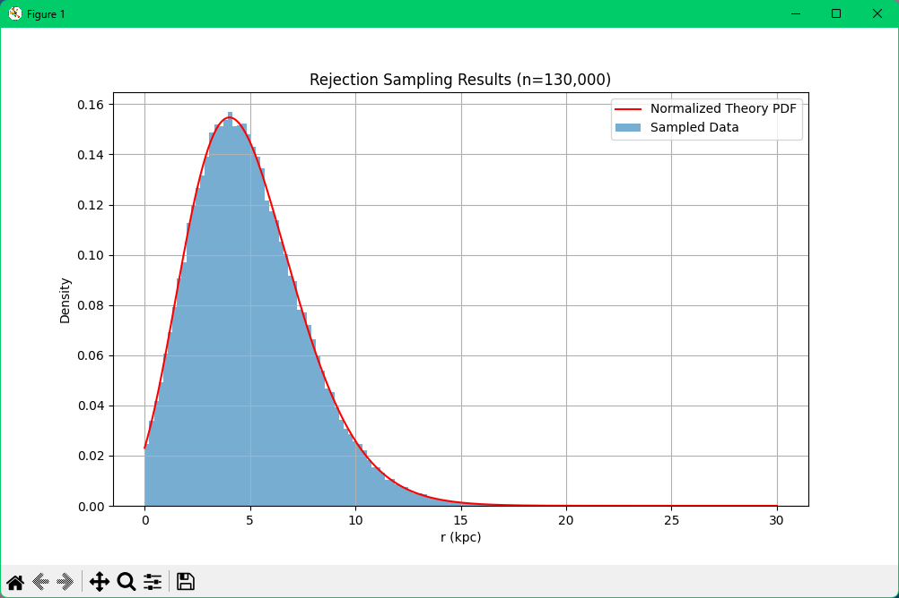

# 拒绝采样生成脉冲星分布

## 任务描述
使用拒绝采样方法生成130,000个符合给定概率密度函数的样本，并绘制理论曲线与样本直方图。

## 参数
- `R0 = 8.3` kpc（太阳到银河系中心的距离）
- `A = 20.41`, `a = 9.03`, `b = 13.99`, `Rpu = 3.76`

## 代码
```python
import numpy as np
from scipy.optimize import minimize_scalar
from scipy.integrate import quad
import matplotlib.pyplot as plt

# 参数设置
R0 = 8.3  # kpc
A = 20.41
a = 9.03
b = 13.99
Rpu = 3.76
r_min = 0.0
r_max = 30.0  # 提议分布范围

def rho(r):
    """定义目标概率密度函数"""
    denominator = R0 + Rpu
    term = (r + Rpu) / denominator
    term1 = term ** a
    exponent = -b * (r - R0) / denominator
    term2 = np.exp(exponent)
    return A * term1 * term2

# 寻找rho(r)的最大值以确定M
result = minimize_scalar(lambda r: -rho(r), bounds=(r_min, r_max), method='bounded')
max_rho_val = rho(result.x)
M = max_rho_val * (r_max - r_min)  # 计算M确保M*g(r) >= rho(r)
print(f"Maximum rho: {max_rho_val} at r={result.x:.2f} kpc, M={M:.2f}")

# 拒绝采样生成样本
samples = []
num_samples = 130000
total_trials = 0

while len(samples) < num_samples:
    r_candidate = np.random.uniform(r_min, r_max)
    ratio = rho(r_candidate) / max_rho_val  # 计算接受概率
    u = np.random.uniform(0, 1)
    total_trials += 1
    if u <= ratio:
        samples.append(r_candidate)
    # 进度提示
    if len(samples) % 10000 == 0:
        print(f"Generated {len(samples)} samples...")

acceptance_rate = num_samples / total_trials
print(f"Acceptance rate: {acceptance_rate:.4f}")

# 计算理论曲线的归一化常数
integral, _ = quad(rho, r_min, r_max)
normalization = 1 / integral

# 绘制结果
plt.figure(figsize=(10, 6))
r_values = np.linspace(r_min, r_max, 500)
rho_normalized = [rho(r) * normalization for r in r_values]
plt.plot(r_values, rho_normalized, 'r-', label='Normalized Theory PDF')

plt.hist(samples, bins=100, density=True, alpha=0.6, label='Sampled Data')
plt.xlabel('r (kpc)')
plt.ylabel('Density')
plt.legend()
plt.title('Rejection Sampling Results (n=130,000)')
plt.grid(True)
plt.savefig('distribution.png')
plt.show()
```
## 结果

