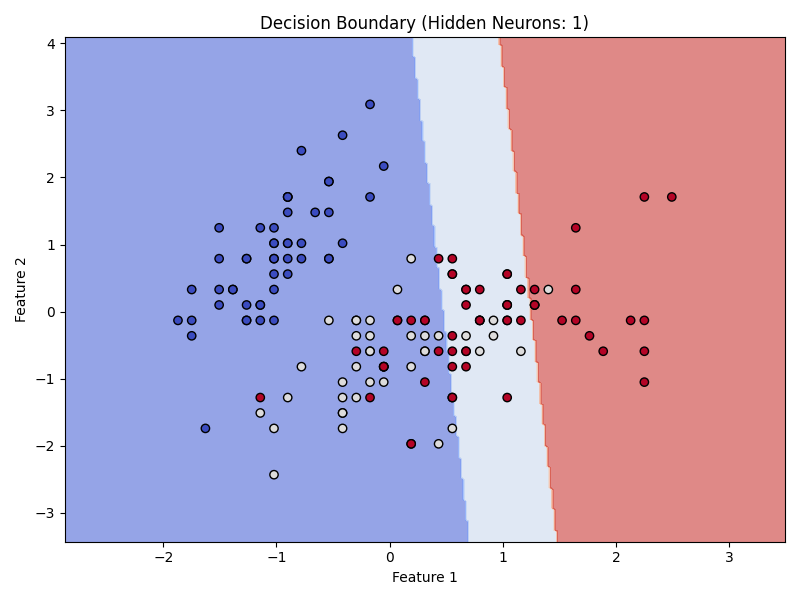
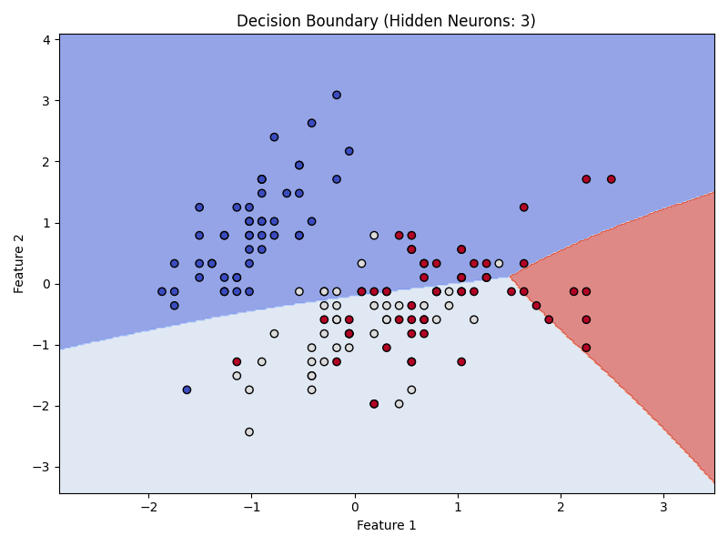
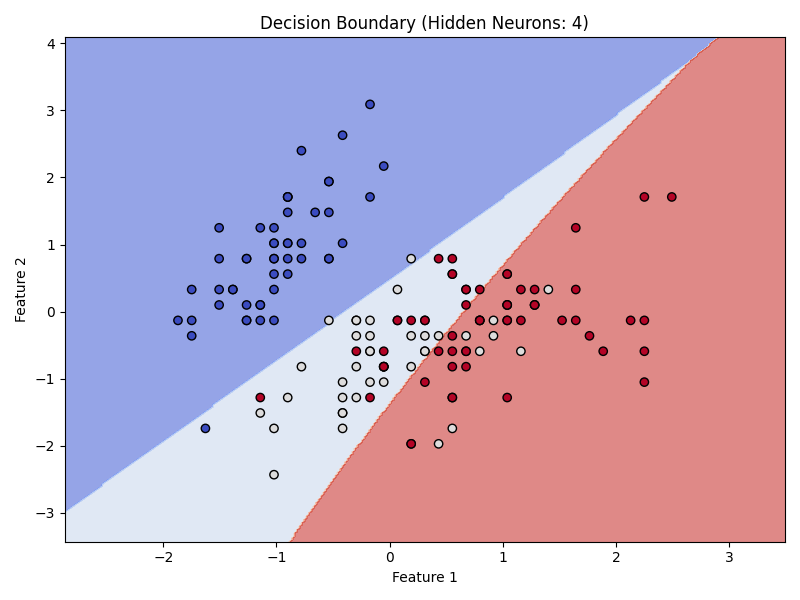
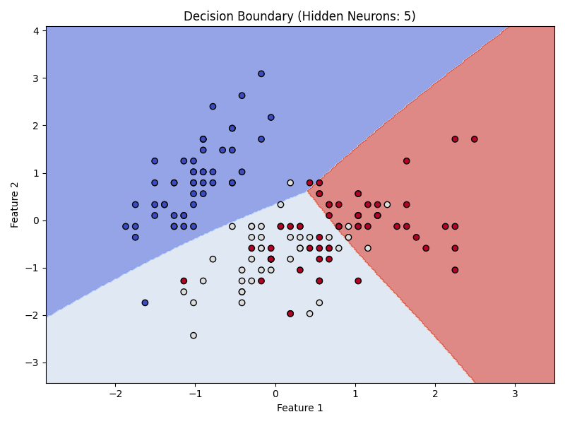
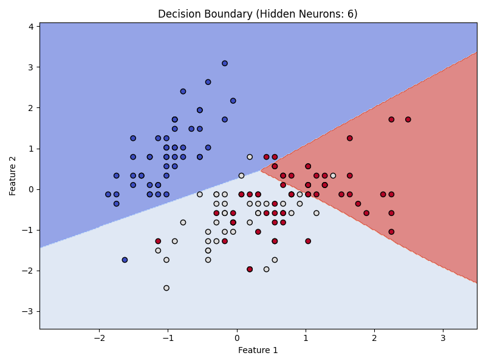
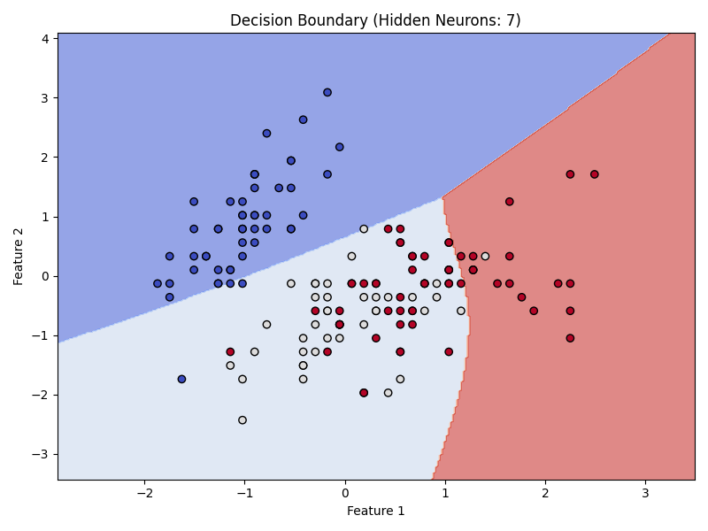

# Iris 神经网络分类实验报告

本实验使用 `Iris` 数据集，搭建了一个多层前馈神经网络，激活函数使用 `sigmoid`，实现对三类鸢尾花的分类任务。

##实验目标

- 使用不同数量神经元的单隐藏层神经网络（从 1 到 7 个神经元）
- 使用 3 个神经元隐藏层的网络为标准示例
- 观察模型性能变化，绘制决策边界图

## 网络结构

- 输入层：4 个特征（Iris 数据集）
- 隐藏层：1~7 个神经元（本实验重点）
- 激活函数：Sigmoid
- 输出层：3 个 softmax 单元，对应 3 类鸢尾花

## 代码
```python

import numpy as np
import matplotlib.pyplot as plt
from sklearn.datasets import load_iris
from sklearn.model_selection import train_test_split
from sklearn.preprocessing import StandardScaler
import tensorflow as tf
import os

# 创建保存图像的目录
output_dir = "iris_nn_plots"
os.makedirs(output_dir, exist_ok=True)

# 1. 加载和预处理数据
iris = load_iris()
X = iris.data
y = iris.target

# 标准化特征
scaler = StandardScaler()
X_scaled = scaler.fit_transform(X)
y_cat = tf.keras.utils.to_categorical(y, num_classes=3)

# 使用完整4维数据训练，但只用前2个特征可视化
X_2d = X_scaled[:, :2]

X_train, X_test, y_train, y_test = train_test_split(X_scaled, y_cat, test_size=0.2, random_state=42)

# 2. 决策边界绘图函数
def plot_decision_boundary_2d(model, X_vis, y_true, neurons):
    x_min, x_max = X_vis[:, 0].min() - 1, X_vis[:, 0].max() + 1
    y_min, y_max = X_vis[:, 1].min() - 1, X_vis[:, 1].max() + 1
    xx, yy = np.meshgrid(np.linspace(x_min, x_max, 300),
                         np.linspace(y_min, y_max, 300))
    grid = np.c_[xx.ravel(), yy.ravel()]
    X_input = np.zeros((grid.shape[0], 4))
    X_input[:, :2] = grid

    preds = model.predict(X_input, verbose=0)
    Z = np.argmax(preds, axis=1).reshape(xx.shape)

    plt.figure(figsize=(8, 6))
    plt.contourf(xx, yy, Z, cmap=plt.cm.coolwarm, alpha=0.6)
    plt.scatter(X_vis[:, 0], X_vis[:, 1], c=np.argmax(y_true, axis=1), cmap=plt.cm.coolwarm, edgecolors='k')
    plt.title(f"Decision Boundary (Hidden Neurons: {neurons})")
    plt.xlabel("Feature 1")
    plt.ylabel("Feature 2")
    plt.tight_layout()
    plt.savefig(f"{output_dir}/nn_hidden_{neurons}.png")
    plt.close()

# 3. 训练和绘图循环（1~7个神经元）
for neurons in range(1, 8):
    print(f"Training model with {neurons} hidden neurons...")
    model = tf.keras.models.Sequential([
        tf.keras.layers.Dense(neurons, activation='sigmoid', input_shape=(4,)),
        tf.keras.layers.Dense(3, activation='softmax')
    ])
    model.compile(optimizer='adam',
                  loss='categorical_crossentropy',
                  metrics=['accuracy'])
    model.fit(X_train, y_train, epochs=100, batch_size=16, verbose=0)
    plot_decision_boundary_2d(model, X_2d, y_cat, neurons)

print("✅ 所有图像已生成并保存在 iris_nn_plots 文件夹中。")

```


## 实验结果图

下方展示了不同神经元数量对应的决策边界图：







